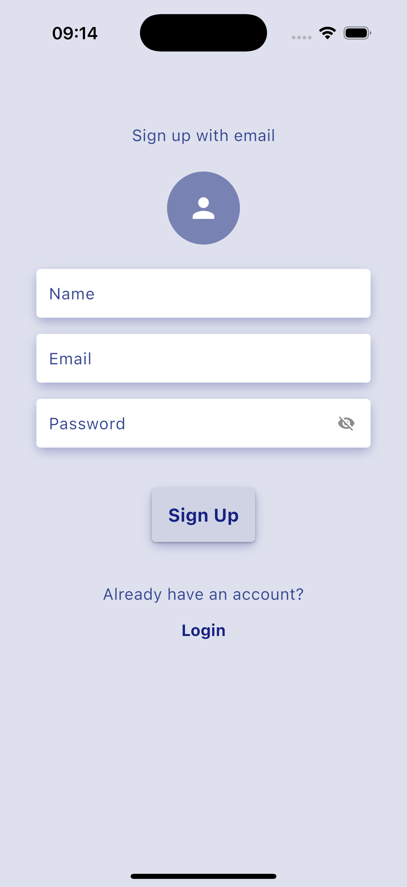
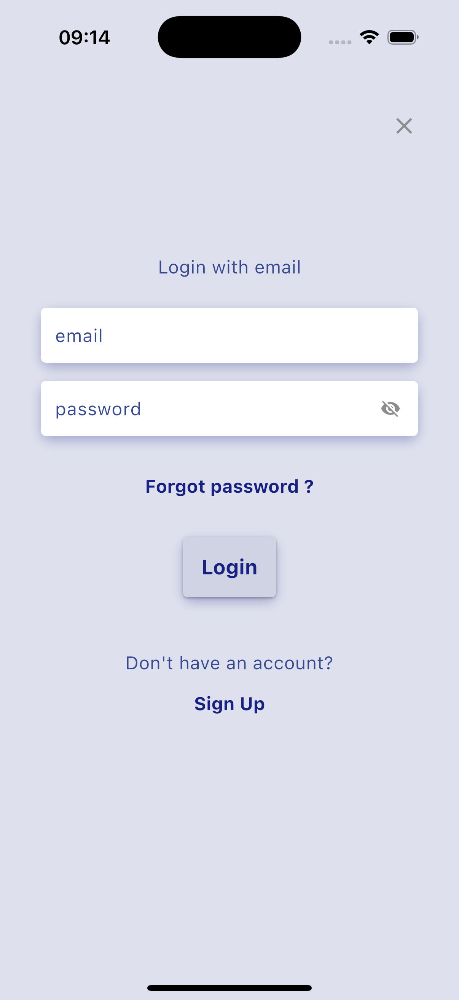
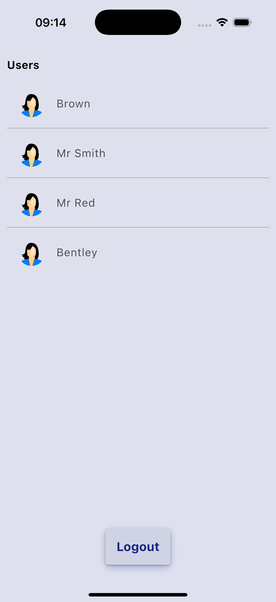

# Demo Flutter App

A Flutter application showcasing user authentication and Firestore integration. This app includes features like user registration, login, and a home screen displaying a list of users.

---

## Features

- User Registration with Firestore integration.
- Secure Login with Firebase Authentication.
- Real-time user list fetched from Firestore.
- Logout functionality.

---

## Screenshots

<table>
  <tr>
    <td align="center">Register Screen</td>
    <td>&nbsp;&nbsp;&nbsp;</td>
    <td align="center">Login Screen</td>
    <td>&nbsp;&nbsp;&nbsp;</td>
    <td align="center">Home Screen</td>
  </tr>
  <tr>
    <td></td>
    <td>&nbsp;</td>
    <td></td>
    <td>&nbsp;</td>
    <td></td>
  </tr>
</table>

---

## Demo Video

[](assets/videos/demo_video.mp4)

---

## Demo Login Details

Use the following credentials to log in:

- **Email**: `smith@gmail.com`
- **Password**: `testing`

- **Email**: `test@gmail.com`
- **Password**: `testing`

- **Email**: `jason@gmail.com`
- **Password**: `testing`

---

## Download APK

Click the link below to download the APK file:

[Download APK](assets/apk/app-release.apk)

---

## Getting Started

### Prerequisites

- Flutter SDK installed on your machine.
- Firebase project set up with Firestore and Authentication enabled.

### Installation

1. Clone the repository:

   ```bash
   git clone https://github.com/peterBrxwn/demo_app.git
   cd demo-flutter-app